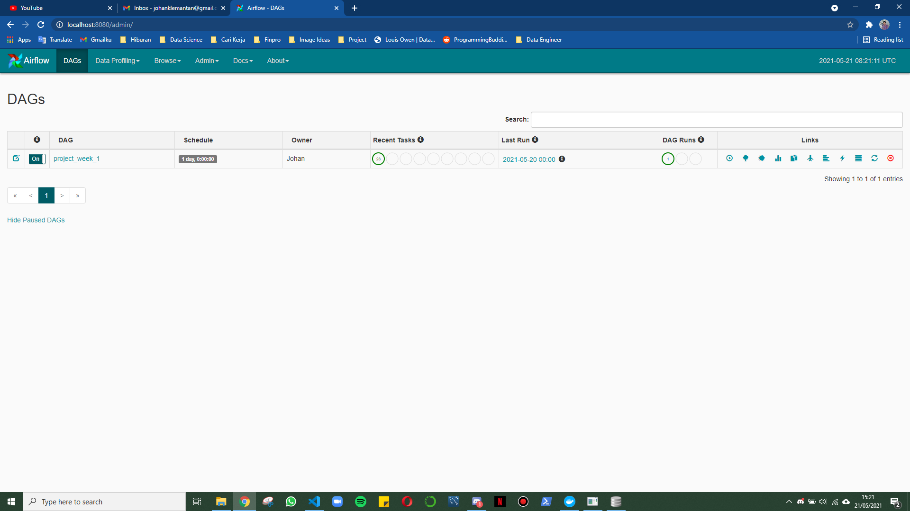
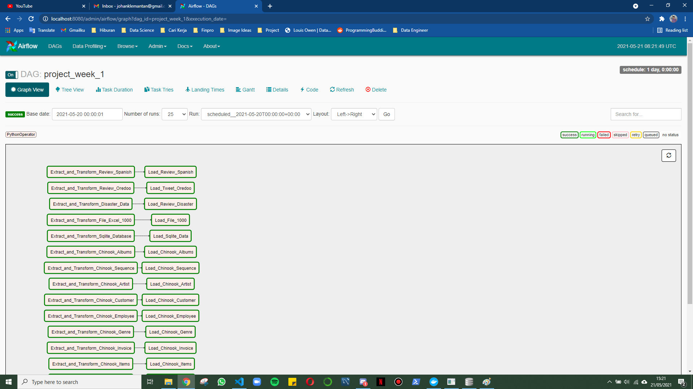
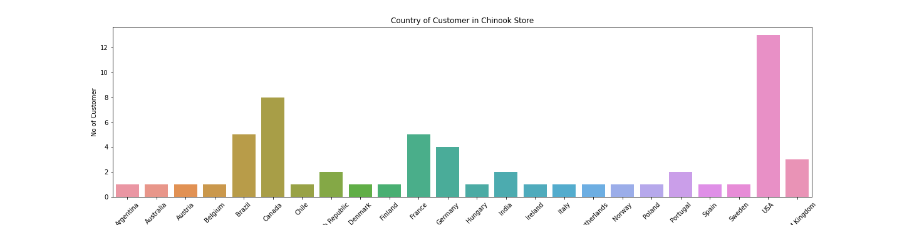
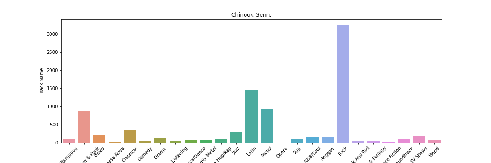
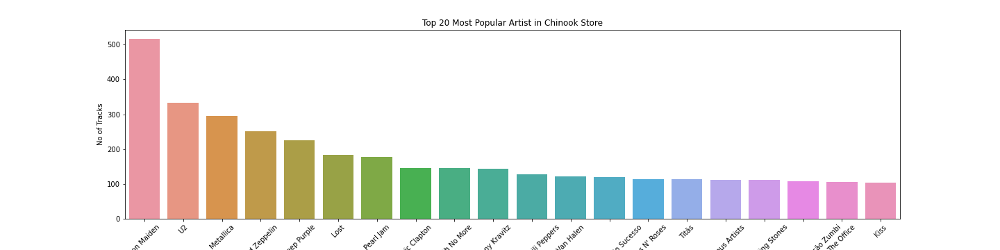

# Local ETL Using Airflow

Airflow is a software used to automating the process of ETL (Extract, Transform, and Load) of some file with different type, resulting into one Data Warehouse. In this task, I will use sqlite as Data Warehouse type.

### Requirements<br>
Used library will be attached in ```requirements.txt```<br>
In this task, I am going to use :<br>
- Pandas (extract, data cleaning (transform), and loading)
- Sqlite3 (load and cleaning data of sqlite type)
- Docker (for easier Airflow environment usage)
- Apache-Airflow (automation ETL software)
- XLRD (convert excel into csv file)
- Seaborn (visualization)
- Matplotlib (visualization)

### Installation<br>
- Install Docker from <a href='https://docs.docker.com/compose/install/'>here</a><br>
- Follow the instruction for installation, and turn on the Docker dashboard<br>
- Clone this git repository ```https://github.com/Johanklemantan/Local-ETL-Using-Airflow.git``` <br>
- Download the raw data from <a href='https://drive.google.com/drive/folders/1hBPZApnbmfrUWBIXLw6Nw8Tk8FtlSrrK?usp=sharing'>here</a><br>
- Save all the data and place into your ```file_location```

### How to Use <br>
- Open the ```docker-compose.yml``` file and change the ```volumes``` as per your ```file_name``` and ```file_location```<br>
- Go to the terminal and type ```docker-compose up```<br>
- The Airflow Environment will be runned and local webserver 8080 will be generated <br>
- Because this docker environment is taken from other person which is excluded XLRD, the library need to be added manually by :<br>
  - Open docker dashboard<br>
  - Choose Webserver 8080 <br>
  - Click on terminal (CLI) <br>
  - Type ```pip install xlrd```
  - Close the terminal
- Open localhost:8080 and you will get this airflow environment:<br>
<br>
- Turn the button to ON and wait the ETL Process is being executed<br>
- Finally, the output is one big datawarehouse containing some tables of the raw data <br>
- To turn off the airflow environment, type ```docker-compose down```<br>

### Script Explanation <br>
- In this task, I'm combining Extract and Transform Process into One task because I think it's simpler in this way, then I put the load in the next task<br>
- The process is showed here :<br>
<br>
- From 10 raw data, I clean and make 14 clean tables out of it <br> 
- You can check the result <a href='https://drive.google.com/drive/folders/1nVZvWMt_oXpL68u1_sp1mE_YLpp_iavP?usp=sharing'>here</a> under a sqlite file named 'data-warehouse.sqlite'<br>

### Visualization <br>
- From the chinook data, I managed to visualize some facts :<br>
  - Chinook is a Music Store which most likely based on Canada because all of their employee comes from Canada<br>
  - There are 58 of their customers separated from all over the world. But USA is dominating with 22% following by Brazil and France each 8.5% <br>
  <br>
  - The music sell in the Chinook store has 25 genres, but 37% of their track has genre Rock<br>
  <br>
  - Here are top 20 most popular artist who's track is sold in Chinook. Of course, it is dominated by heavy metal band, such as Iron Maden and Metallica<br>
  <br>

#### Thankyou and Happy Coding
  
